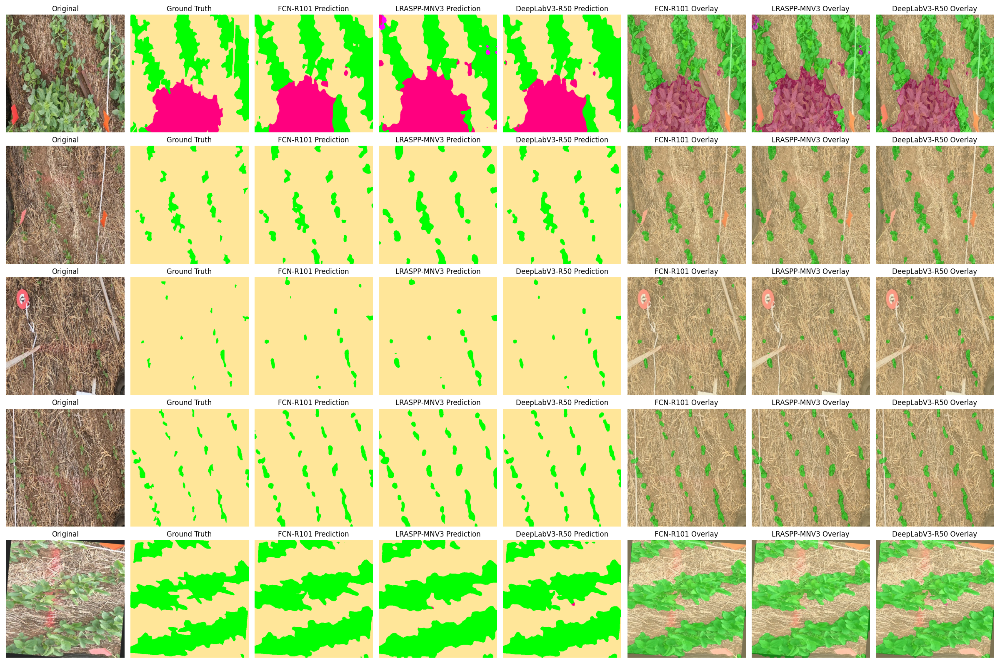

# Soybean Weeds Semantic Segmentation using FCN vs LRASPP vs DeepLabV3

## 🌱 Soybean Weeds Dataset 

[](https://www.python.org)
[](https://pytorch.org)


### 🎯 Goal
Compared 3 semantic segmentation models (**FCN, LRASPP, DeepLabV3**) on a weed/soybean segmentation task from the **Soybean Weeds** dataset. Evaluated performance in terms of **mIoU**, **per-class metrics**, and **visual quality**.

---

## 📂 Dataset Structure

Organized as:

```
datasets/
└── soybean_weeds/
    ├── train/
    │   ├── images/
    │   └── masks/
    └── valid/
        ├── images/
        └── masks/
```

Total train images: 1398 / Total valid images: 350

Each image has a corresponding `.png` mask with **4 semantic classes**:
1. `background`
2. `broad_leaf_weed`
3. `grassy_weed`
4. `soy_plant`

---

## 🏗️ Models Trained

| Model           | Backbone            | Params | Style          |
|----------------|----------------------|--------|----------------|
| FCN-R101        | ResNet-101           | 🔹 Large  | Coarse, accurate |
| LRASPP-MNV3     | MobileNetV3-Large    | ✅ Lightweight | Fast & efficient |
| DeepLabV3-R50   | ResNet-50            | ⚖️ Balanced | Fine details     |

All models were trained using:
- CrossEntropyLoss (with class weights)
- 20 epochs
- AdamW optimizer
- Best model saved using mIoU on validation

---

## ⚙️ Training & Evaluation

### 🔧 Preprocessing
- Images resized to `512x512`
- Normalized using ImageNet mean/std
- Light augmentations on training set using `albumentations`

### 🧪 Evaluation Metrics
Using `torchmetrics`:
- **mIoU** (Mean Intersection over Union)
- **Precision**, **Recall**, **F1-score**
- All metrics computed **per-class** and **averaged**

---

## 📊 Final Evaluation

### 🔬 Per-Class Metrics (IoU / Precision / Recall / F1)

| Class            | FCN-R101         | LRASPP-MNV3      | DeepLabV3-R50   |
|------------------|------------------|------------------|-----------------|
| background       | `0.9568 / 0.9968 / 0.9597 / 0.9779` | `0.9380 / 0.9961 / 0.9414 / 0.9680` | `0.9574 / 0.9973 / 0.9599 / 0.9782` |
| broad_leaf_weed  | `0.6986 / 0.7182 / 0.9623 / 0.8225` | `0.5753 / 0.5842 / 0.9743 / 0.7304` | `0.6829 / 0.6970 / 0.9713 / 0.8116` |
| grassy_weed      | `0.5788 / 0.5936 / 0.9587 / 0.7332` | `0.4573 / 0.4657 / 0.9618 / 0.6276` | `0.5281 / 0.5379 / 0.9667 / 0.6912` |
| soy_plant        | `0.8318 / 0.8493 / 0.9758 / 0.9082` | `0.7745 / 0.7984 / 0.9627 / 0.8729` | `0.8381 / 0.8551 / 0.9769 / 0.9119` |

### 📈 Average Metrics

| Model           | mIoU  | Precision | Recall | F1-score |
|----------------|--------|-----------|--------|----------|
| **FCN-R101**        | `0.7665` | `0.7895`  | `0.9641` | `0.8605`  |
| **LRASPP-MNV3**     | `0.6863` | `0.7111`  | `0.9600` | `0.7997`  |
| **DeepLabV3-R50**   | `0.7516` | `0.7718`  | `0.9687` | `0.8482`  |

---

## 🎨 Visualizations

**Visual comparison tool** has been provided showing in each row:  

`Original | Ground Truth | FCN | LRASPP | DeepLabV3 | FCN Overlay | LRASPP Overlay | DeepLabV3 Overlay`

<p align="center">
  
</p>

---

## ✅ Findings

- **FCN-R101** performed the best overall — strong detail and boundary segmentation.
- **LRASPP-MNV3** is impressively fast with low GPU usage, suitable for mobile or embedded use.
- **DeepLabV3-R50** is a strong all-around performer with balanced accuracy and speed.
- **Recall is consistently high across all models**, confirming that the models rarely miss target objects.
- All models generalize well — final `mIoU` matches validation metrics, and visuals support this.

---

## 🚀 How to Run Inference
```python
# Example: visualize 5 random validation samples
visualize_all_models(valid_dataset, num_images=5, alpha=0.4)
```
---

## 📄 License

This project is intended for **academic research and educational use** only. Please cite **appropriately to this repo** if used in publications.

---

## ✨ Acknowledgements

- Dataset by Roboflow
- Models from `torchvision.models.segmentation`
- Evaluation powered by `torchmetrics`

---
